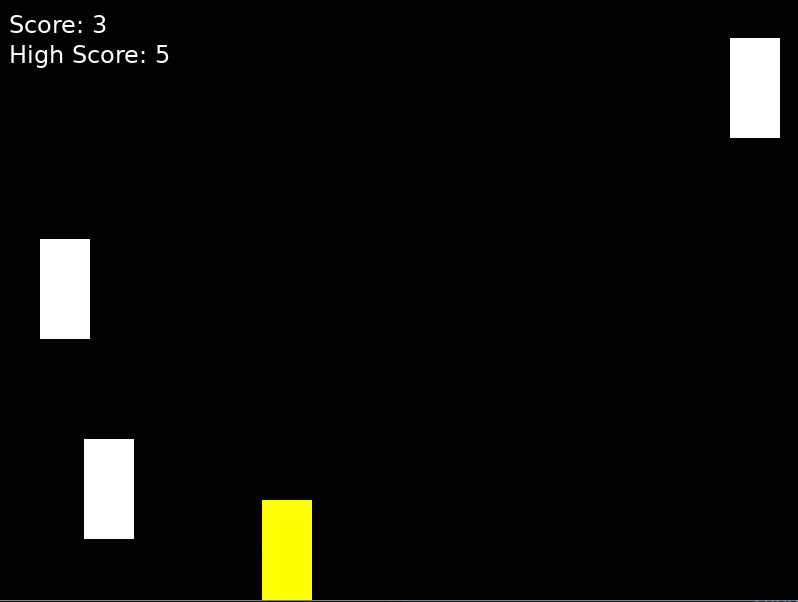

# Simple Car Game in LOVE2D

This is a simple 2D car game created using the LOVE2D game framework. The player controls a car that must avoid obstacles and collect power-ups to increase the score. The game also features a speed boost power-up and increasing difficulty over time.

## Gameplay

- **Car Control:** Use the left and right arrow keys to move the car.
- **Score:** Points are earned by avoiding obstacles.
- **Speed Boost:** Collect power-ups to temporarily increase the car's speed.
- **Difficulty:** The game becomes progressively harder as obstacles move faster over time.

## Features

- **Obstacle Avoidance:** The car must avoid incoming obstacles.
- **Power-ups:** Collect power-ups to gain a temporary speed boost.
- **Increasing Difficulty:** Obstacle speed increases gradually as you play.
- **Pause/Resume:** Press `P` to pause or resume the game.
- **Game Over:** When the car collides with an obstacle, the game ends and can be restarted by pressing the Enter key.

## How to Run

1. Ensure you have LOVE2D installed. You can download it from the official [LOVE2D website](https://love2d.org/).
2. Save the game code in a file named `main.lua`.
3. Open it in an editor
4. run the file

